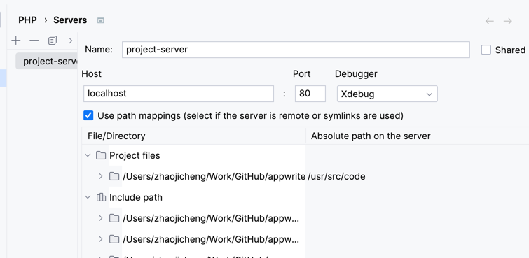

使用xdebug调试appwrite花了两三天的时间
首先appwrite使用了协程框架swoole,根据官方说明5.0的版本已经支持xdebug了.不需要再使用yads.而且yads很不好用.
虽然appwrite官方文档说明使用yads来进行degug,但经过我的实际使用效果来看很不理想,调方式的过程当中经常由于程序问题导致docker容器强制关闭.
而且官司方最新的docker-base已经加入了xdeug的组件.
记录主要的几点:
1.修改Dockerfile
a. FROM appwrite/base:0.4.3 as final 替换为 FROM appwrite/base:0.6.0 as final
b.修改 ARG DEBUG=false 替换 ARG DEBUG=true
c. 注释掉 这一行, 我们不需要yads RUN if [ "$DEBUG" == "true" ]; then printf "zend_extension=yasd \nyasd.debug_mode=remote \nyasd.init_file=/usr/src/code/dev/yasd_init.php \nyasd.remote_port=9005 \nyasd.log_level=0" >> /usr/local/etc/php/conf.d/yasd.ini; fi
增加xdebug
RUN if [ "$DEBUG" == "true" ]; then \
    echo zend_extension=xdebug.so >> /usr/local/etc/php/conf.d/xdebug.ini \
    && echo xdebug.mode=develop,debug  >> /usr/local/etc/php/conf.d/xdebug.ini \
    && echo xdebug.enable=1  >> /usr/local/etc/php/conf.d/xdebug.ini \
    && echo xdebug.start_with_request=yes  >> /usr/local/etc/php/conf.d/xdebug.ini \
    && echo xdebug.discover_client_host=0  >> /usr/local/etc/php/conf.d/xdebug.ini \
    && echo xdebug.client_host=host.docker.internal  >> /usr/local/etc/php/conf.d/xdebug.ini \
    && echo xdebug.client_port=9005  >> /usr/local/etc/php/conf.d/xdebug.ini; \
    fi
c.如果你使用phpstorm
.env文件中增加
PHP_IDE_CONFIG=serverName=project-server名字任意但是需要和phpstorm的服务器配置一致
然后把PHP_IDE_CONFIG加入到docker-compose.yml各个server的环境变量中

phpstorm如果选择第一行代码停止,可能会导致docker服务启动不了原因未知
d.如果还是不能调试请把docker的volumes删除掉重头来做
由于appwrite有多个docer容器,多容器同时启动(15个)对于phpstorm来说,貌似并发处理不太好,listen的过程很容易导致dockr容器断点中断,且不会自动恢复,影响调试,所以还是用visual code吧

docker compose build&&docker compose up -d
docker ps -aq | xargs docker stop | xargs docker rm
docker volume ls -qf dangling=true | xargs  docker volume rm

有用的文档
https://github.com/appwrite/appwrite/blob/main/CONTRIBUTING.md

docker run --rm --interactive --tty \
  --volume $PWD:/app \
  composer update --ignore-platform-reqs --optimize-autoloader --no-plugins --no-scripts --prefer-dist

设置git代理
git config --global https.proxy http://127.0.0.1:7890

git config --global https.proxy https://127.0.0.1:7890
取消代理
git config --global --unset http.proxy

git config --global --unset https.proxy

查看代理
git config --global --get http.proxy
git config --global --get https.proxy

docker compose build 

docker compose u -d
